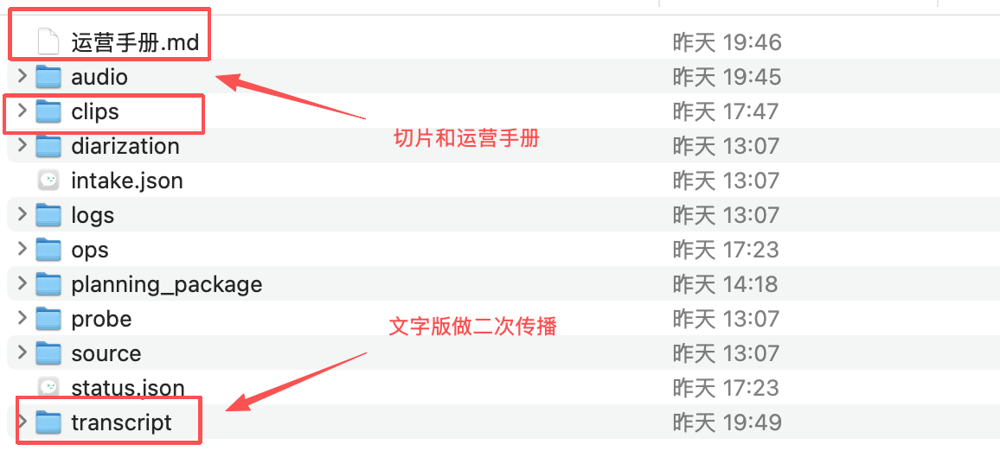
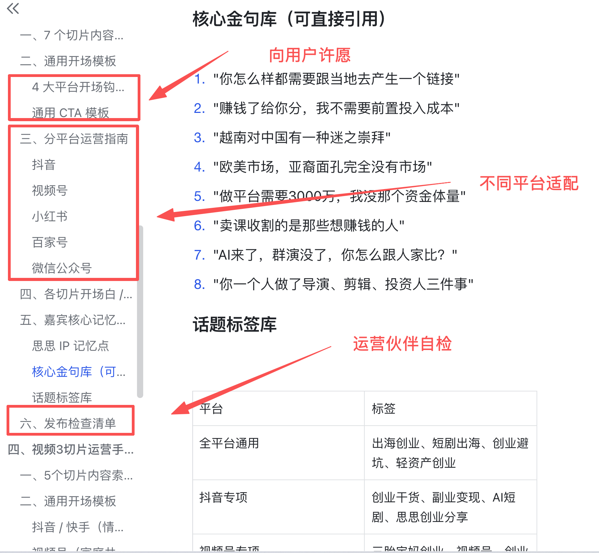
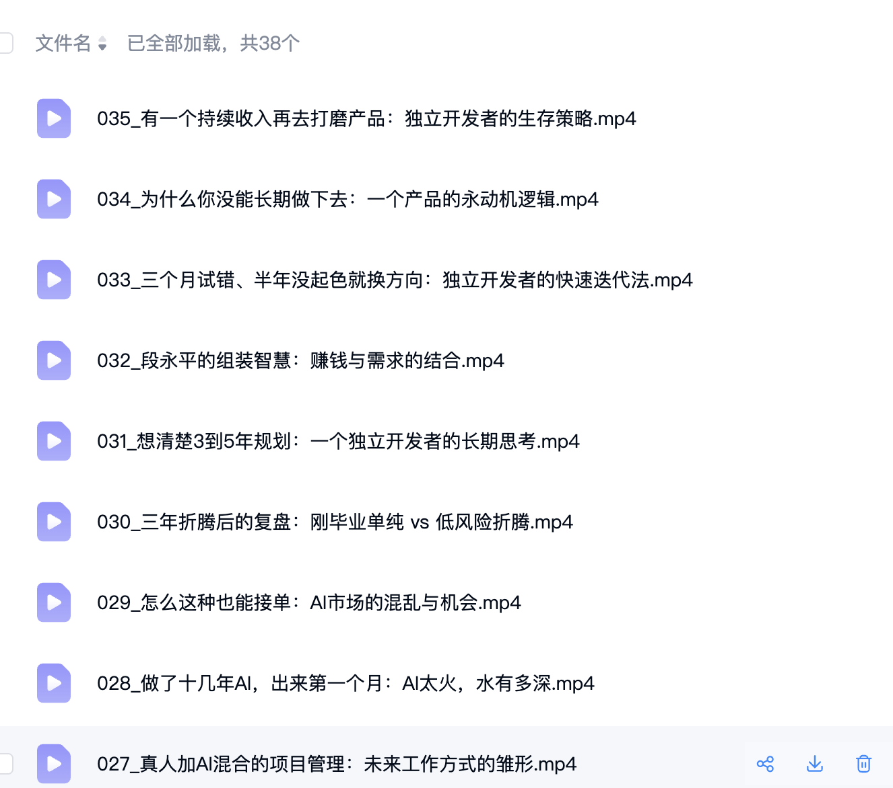

# clipclipskill

⭐ If this skill is useful to you, please give this repo a Star. 如果这个 Skill 对你有帮助，欢迎给这个仓库点个 Star。

[中文](#中文) | [English](#english)

Agent skill for turning long videos into short clips, shorts, reels, and social-ready publishing assets.

⭐ Star | 🌍 Cross-platform | ♻️ Resumable | 💸 Token-efficient | 🎯 Vertically tuned

Install this skill, send your video directory to your agent, confirm the video type, and let it generate transcript-driven clips plus publishing assets.

It supports different clipping strategies for different verticals, including interviews, speeches, podcast-style conversations, online courses, gaming livestreams, and sports events.

## English

### What this skill is

`clipclipskill` is a local-first agent skill for long-form video repurposing.

After installation, the normal usage is simple:
- send a local video directory or source URL to your agent
- let the skill probe the media
- confirm the video type and clipping strategy
- generate transcript-driven clip plans
- render clips and output publishing assets

It helps creators, editors, operators, and growth teams:
- clip podcasts into short videos
- repurpose interviews, speeches, courses, livestreams, and sports events
- extract transcripts with Whisper-first tooling
- generate clip plans from transcripts
- render clips into deterministic folders
- produce publishing copy for short-form video operations

### Supported video types

This skill is vertically tuned instead of using one generic clipping strategy for everything.

Supported and optimized video types include:
- interview videos
- speech and presentation videos
- podcast-style conversations
- online course videos
- gaming livestream videos
- sports event and highlight videos

### 🚀 Why users choose it

- saves tokens because most pipeline decisions are hardcoded instead of re-prompted every step
- works well for long-video jobs because the workflow is stateful and resumable
- does not fear disconnects or interrupted sessions because job state is persisted in `status.json`
- keeps outputs predictable for editors and operators with stable folders and explicit approval gates
- reduces repeated operator communication by turning one long video into clips plus publishing assets in one flow
- uses different clipping strategies for different video types instead of forcing one generic template on everything

### User-side value

For creators and teams, this means:
- lower token cost on repeated video clipping work
- safer long-running processing for large videos
- easier handoff from clipping to operations
- less context rebuilding after agent restarts or network interruptions
- more consistent outputs across podcast, course, interview, livestream, and highlights workflows

### Search-friendly keywords

agent skill, AI agent skill, video clipping skill, long video to short clips, AI video clipping, podcast clipping, transcript-based clip planning, Whisper transcription, YouTube clipping, Bilibili clipping, short-form content repurposing, token-efficient agent workflow, resumable video processing, state machine workflow.

### Input sources

- local media files with `--video`
- YouTube URLs with `--url`
- Bilibili URLs with `--url`

### Best for

- podcast to shorts workflows
- interview clipping
- online course repurposing
- gaming livestream clipping
- sports highlight extraction
- short-video operations handoff

### Main entrypoints

- `SKILL.md`
- `clipclipskill` CLI
- `scripts/` thin wrappers

### Canonical flow

- `clipclipskill --workspace-dir /path/to/output start-job ...`
- `clipclipskill --workspace-dir /path/to/output probe --job-id <job_id>`
- `clipclipskill --workspace-dir /path/to/output confirm-template --job-id <job_id> ...`
- `clipclipskill --workspace-dir /path/to/output transcribe --job-id <job_id>`
- `clipclipskill --workspace-dir /path/to/output plan --job-id <job_id>`
- `clipclipskill --workspace-dir /path/to/output approve-plan --job-id <job_id>`
- `clipclipskill --workspace-dir /path/to/output render --job-id <job_id>`
- `clipclipskill --workspace-dir /path/to/output ops --job-id <job_id>`
- `clipclipskill --workspace-dir /path/to/output validate --job-id <job_id>`

You can also set `CLIPCLIPSKILL_WORKSPACE=/path/to/output` to make all job folders and generated artifacts land in that directory.

If you want to avoid repeating the directory, bind it once:

```bash
clipclipskill bind-workspace /path/to/output
clipclipskill doctor
clipclipskill start-job --video /path/to/video.mp4 --template podcast_interview
clipclipskill probe --job-id <job_id>
```

Use `clipclipskill unbind-workspace` to clear that default.

At startup, each command checks the dependencies it needs before running. For URL jobs, `probe` downloads the source video into `<workspace-dir>/<job_id>/source/` first, then the rest of the pipeline reuses the downloaded local file.

### Workflow requirements

Before a job moves past the probe stage, the skill always asks for or confirms:
- a local video path or a supported source URL
- content template
- preferred clip length
- whether Whisper-first transcription should be used
- whether speaker diarization should be enabled or auto-decided

Operational rules:
- always run metadata probe before transcription
- always report duration, file size, audio presence, and estimated processing time
- always require explicit confirmation of template and clipping strategy before transcription
- always require explicit confirmation of the clip plan before rendering
- always run final validation after ops generation and before marking the job completed
- always persist job state in `<workspace-dir>/<job_id>/status.json`
- always prefer resuming from existing artifacts when available

### Deliverables

Each completed job outputs a stable handoff package under `<workspace-dir>/<job_id>/`, including:
- `status.json`
- `planning_package/clip_plan.v1.json`
- `planning_package/clip_artifacts/<topic>_<seq>.srt`
- `planning_package/clip_artifacts/<topic>_<seq>.json`
- `clips/<topic>_<seq>.mp4`
- `ops/operations_manual.md`
- `ops/publish_manifest.json`

Validation is not optional: the workflow checks clip playback integrity and rejects off-topic publishing copy, leaked process text, and filename-style wording before the job is considered complete.

### Examples

```bash
clipclipskill --workspace-dir /path/to/output start-job --video /path/to/video.mp4 --template podcast_interview
clipclipskill --workspace-dir /path/to/output probe --job-id <job_id>
```

```bash
clipclipskill start-job --url https://youtu.be/<video_id> --template podcast_interview
clipclipskill probe --job-id <job_id>
```

```bash
clipclipskill start-job --url https://www.bilibili.com/video/<bv_id> --template solo_course
clipclipskill probe --job-id <job_id>
```

### Screenshots

#### 🗂 Output structure



#### 📘 Operations manual



#### 🎬 Clip example



## 中文

### 这是什么

`clipclipskill` 是一个面向多种 Agent 运行环境的本地优先视频切片 Skill，用来把长视频拆成短视频、短片段和可直接交付运营的发布素材。

安装后，你只需要把本地视频目录或视频链接发给 Agent，先确认视频类型，再按对应策略继续转录、规划切片、生成成片和运营素材。

它适合这些目标用户：
- 播客剪辑团队
- 短视频运营团队
- 内容增长团队
- 课程内容二次分发团队
- 直播切片人员
- 需要把 YouTube 或 B 站长视频批量拆条的创作者

### 支持的视频类型

这不是一个所有视频都用同一套切法的通用剪辑流程，而是针对垂直场景做过调优的 Skill。

当前支持并做了不同切片策略优化的视频类型包括：
- 访谈视频
- 宣讲视频
- 播客对谈视频
- 课程视频
- 游戏直播视频
- 体育赛事与高光视频

### 🚀 为什么用户会选它

- 省 token：大部分流程和判断是硬编码的，不需要每一步都反复消耗模型上下文
- 不怕长视频处理中断：整体流程由状态机驱动，任务状态会持续落盘
- 不怕断线或 Agent 会话中断：可以基于 `status.json` 继续跑，而不是从头重来
- 对剪辑和运营交付更友好：目录结构稳定，关键环节有明确确认门
- 一条链路完成从转录、选题、切片到发布文案，减少人工反复沟通
- 不同视频类型有不同切片策略，不是把所有内容都按同一模板硬切

### 从应用用户角度的价值

对于创作者、剪辑师、运营同学和增长团队，这意味着：
- 重复做长视频拆条时 token 成本更低
- 大视频、长流程任务更稳，不容易因为中断报废
- 从剪辑到运营交付更顺滑
- Agent 会话重启、网络波动后不需要大量补上下文
- 播客、课程、访谈、直播、高光等场景下输出更一致

### 便于搜索的关键词

Agent Skill、AI Agent Skill、视频切片、长视频切短视频、播客切条、访谈剪辑、课程拆条、Whisper 转录、字幕提取、YouTube 视频剪辑、Bilibili 视频切片、短视频运营素材生成、省 token 工作流、可恢复任务流、状态机工作流。

### 支持输入

- 本地视频文件：`--video`
- YouTube 链接：`--url`
- Bilibili 链接：`--url`

### 核心能力

- 探测长视频元数据
- 使用 Whisper 优先方案提取转录
- 选择内容场景模板
- 基于转录生成 clip plan
- 把成片输出到稳定目录结构
- 生成短视频发布文案与运营交付物

### 典型场景

- 播客切短视频
- 访谈内容拆条
- 课程内容重分发
- 游戏直播高光切片
- 体育高光提取
- 交付运营同学的发布包生成

### 主入口

- `SKILL.md`
- `clipclipskill` CLI
- `scripts/` 薄封装脚本

### 标准流程

- `clipclipskill --workspace-dir /path/to/output start-job ...`
- `clipclipskill --workspace-dir /path/to/output probe --job-id <job_id>`
- `clipclipskill --workspace-dir /path/to/output confirm-template --job-id <job_id> ...`
- `clipclipskill --workspace-dir /path/to/output transcribe --job-id <job_id>`
- `clipclipskill --workspace-dir /path/to/output plan --job-id <job_id>`
- `clipclipskill --workspace-dir /path/to/output approve-plan --job-id <job_id>`
- `clipclipskill --workspace-dir /path/to/output render --job-id <job_id>`
- `clipclipskill --workspace-dir /path/to/output ops --job-id <job_id>`
- `clipclipskill --workspace-dir /path/to/output validate --job-id <job_id>`

### 快速示例

```bash
clipclipskill bind-workspace /path/to/output
clipclipskill start-job --url https://youtu.be/<video_id> --template podcast_interview
clipclipskill probe --job-id <job_id>
```

### 工作流要求

在任务进入转录前，这个 Skill 会始终要求你提供或确认：
- 本地视频路径或受支持的视频 URL
- 内容模板
- 期望片长
- 是否启用 Whisper 优先转录
- 是否启用说话人分离，或交给流程自动决定

流程约束：
- 转录前必须先做 metadata probe
- 必须报告时长、文件大小、是否有音轨、预计处理时间
- 转录前必须让用户明确确认模板和切片策略
- 渲染前必须让用户明确确认 clip plan
- 运营素材生成后、任务完成前必须执行最终 validate
- 任务状态始终落盘到 `<workspace-dir>/<job_id>/status.json`
- 已有产物可复用时优先续跑，不重复从头处理

### 最终交付物

每个完成的任务都会在 `<workspace-dir>/<job_id>/` 下输出稳定的交付结构，包括：
- `status.json`
- `planning_package/clip_plan.v1.json`
- `planning_package/clip_artifacts/<topic>_<seq>.srt`
- `planning_package/clip_artifacts/<topic>_<seq>.json`
- `clips/<topic>_<seq>.mp4`
- `ops/operations_manual.md`
- `ops/publish_manifest.json`

`validate` 不是可选步骤：流程会检查成片播放完整性，并拦截跑题文案、泄露过程性文字、以及类似文件名风格的发布文案，只有通过后任务才算完成。

### 效果截图

#### 🗂 产出目录结构


#### 📘 运营手册示例


#### 🎬 切片样例


### 🌍 跨平台使用与交流群

如果你想在不同 Agent、不同系统、不同工作流里更丝滑地使用这套长视频切片能力，可以访问 [Aurababa.com](https://Aurababa.com)。

如果你想加我微信进用户交流群，直接扫码：


